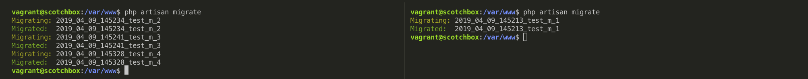

# Laravel Migration Pipeline
A migration pipeline to make sure same migration is not run again in multiple server setup

## Version Support : 

Works for Laravel version 5.3 and above.

## Introduction : 

When you run `php artisan migrate` in laravel, it checks if there are any new migration files which are not yet migrated. If yes, then it runs each migration one by one and adds an entry into `migrations` table with migration name and batch number.

However, when you have multiple servers on autoscalling and have the CICD pipelines to automatically pull the latest releases of git webhooks, the post webhook script having `php artisan migrate` runs almost simultaneously on all those servers.

For example lets say, you have 3 laravel servers running. When you push latest releases to git, git webhook triggers the CICD pipeline and then all servers receive  the webhooks almost at the same time.

All these 3 servers will run webhook scripts, which will have git pull and then php artisan commands. One of which will be `php artisan migrate`. If you have 3 new migrations in the release, all these 3 will be attempted to run with different(mostly consecutive) batch numbers.

We want to avoid that. If a migration is already run on the 1st server out of 3, we do not want 2nd and 3rd server to re-run it. This is when this package comes into picture.

In any given situation, if a migration is running on one server or already run ina different batch number, it will not run again. This will avoid the above problem.

## Installation : 

To install the package using composer : 

~~~bash
composer require techsemicolon/gitdeployer
~~~

Once installed, you can add service provider in `config/app.php` file for laravel version <= 5.4. For later versions the service provider will be automatically included.
~~~php
Techsemicolon\MigrationPipeline\ServiceProvider::class,
~~~

## Example :

Following screenshot gives you an idea where both the servers are running `php artisan migrate` at the same time. However, the right server ran migration_1 hence, left server skipped that and ran the remaining ones. 

Also, once the migration_1 was ran by right server, migration_2, migration_3 and migration_4 were skipped because those were already run by the left server.

    

## Note : 

This package assumes/requires that you give unique names to your migrations. By default each migration in laravel is unique if you use `php artisan make:migration some_table_migration` where laravel adds timestamp at the start of migration file name. But in case you are removing that timestamp, make sure you have something in the migration file name which marks it as unique.

## License : 

This package is open-sourced software licensed under the MIT license